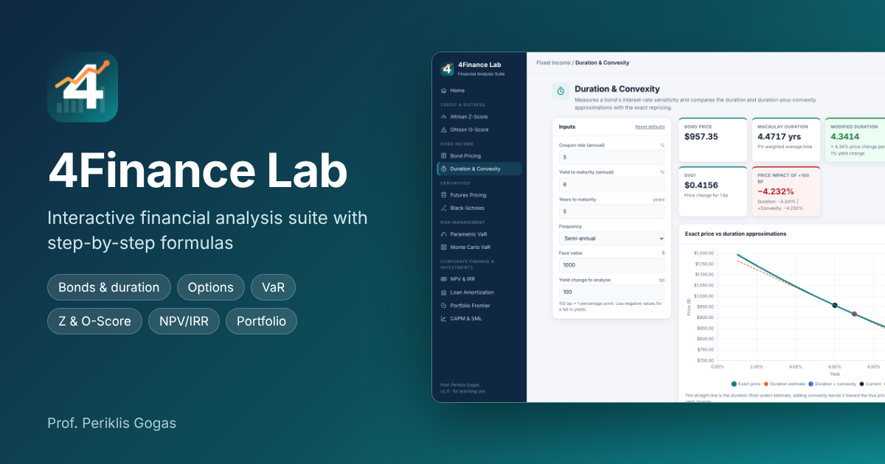

# 4Finance Lab

**Interactive Financial Analysis Suite** by Prof. Periklis Gogas



4Finance Lab is a free, browser-based collection of financial calculators built for teaching. Every tool shows its formulas with a step-by-step worked solution, draws interactive charts, and exports results to Excel (.xlsx) and images (.png). It installs as an app (PWA) and works offline.

## Tools

| Area | Tool | What it does |
|---|---|---|
| Credit & Distress | Altman Z-Score Analyzer | Z (public), Z' (private) and Z'' (non-manufacturing) with zone classification |
| Credit & Distress | Bankruptcy Risk Analyzer | Ohlson (1980) O-Score probability of failure with Altman Z alongside |
| Fixed Income | Bond Pricing Engine | Coupon, zero-coupon and perpetual bonds; solve for price, YTM, coupon, face or maturity |
| Fixed Income | Duration & Convexity | Macaulay and modified duration, convexity, DV01, price impact of a yield shock |
| Derivatives | Futures Pricing | Cost-of-carry model, term structure, arbitrage check against a market price |
| Derivatives | Black-Scholes Option Pricing | Call/put prices, Greeks, put-call parity, implied volatility |
| Risk Management | Parametric VaR | Normal VaR and Expected Shortfall at any confidence level |
| Risk Management | Monte Carlo VaR | Simulated VaR/ES with normal or Student-t returns, seeded for reproducibility |
| Corporate Finance | NPV & IRR | NPV, IRR (multiple-IRR detection), MIRR, PI, payback and discounted payback |
| Corporate Finance | Loan Amortization | Level payment, full schedule, extra payments |
| Investments | Two-Asset Portfolio | Efficient frontier, minimum-variance and tangency portfolios, CML |
| Investments | CAPM & SML | Required returns, Jensen's alpha, over/under-valuation |

## Features

- Sidebar menu and home dashboard; each tool has its own link (for example `index.html#/duration`)
- Live recalculation as you type; inputs are remembered per tool in the browser
- "Formulas & step-by-step solution" panel with the numbers substituted in
- Interactive Chart.js charts (hover tooltips, click legend items to hide series)
- Export: whole tool to Excel (inputs, results, tables, chart data), each chart to PNG or XLSX, each table to PNG or XLSX
- Print / save as PDF report of the current tool
- Light and dark mode
- Installable PWA, works offline (all libraries are bundled locally)

## Publish on GitHub Pages

1. Create a new repository, for example `4finance-lab`.
2. Upload the **contents** of this folder (so `index.html` is at the repository root). Keep the `.nojekyll` file.
3. Go to **Settings > Pages**, set *Source* to `Deploy from a branch`, branch `main`, folder `/ (root)`, and save.
4. After a minute the app is live at `https://<your-username>.github.io/4finance-lab/`.
5. For rich link previews (LinkedIn, Teams, WhatsApp), edit the `og:image` and `twitter:image` lines in `index.html` to the absolute URL, for example `https://<your-username>.github.io/4finance-lab/icons/thumbnail.png`.
6. In the repository's **Settings > General > Social preview**, upload `icons/thumbnail.png`.

When you release changes later, bump `VERSION` at the top of `sw.js` so installed copies pick up the update.

## Folder structure

```
index.html              App shell
css/styles.css          Styles (light/dark themes, print layout)
js/math.js              Numerical routines (normal cdf/inverse, Brent root finder, seeded RNG)
js/tools.js             The 12 tools: inputs, calculations, charts, tables, formulas
js/app.js               Menu, routing, rendering, export, print
lib/                    Chart.js 4.4.4 and SheetJS 0.18.5 (with licenses)
icons/                  App icon (SVG/PNG), maskable icon, social thumbnail, screenshot
manifest.webmanifest    PWA manifest
sw.js                   Service worker (offline cache)
```

## Corrections made in version 2.0

- **Ohlson O-Score:** four coefficients were attached to the wrong variables in v1. Now uses Ohlson's Model 1: OENEG (TL > TA dummy) = -1.72, NITA = -2.37, FUTL = -1.83, INTWO (two-year loss dummy) = +0.285. The GNP price-level index used in SIZE is now an input (default 100).
- **Bankruptcy analyzer:** Altman zone cut-offs aligned with the Z-Score tool (1.81 / 2.99).
- **Bond YTM:** replaced the unguarded 20-step Newton iteration with Brent's method; yields are no longer rounded to 2 decimals; compounding frequency added; zero-rate and impossible-input cases are handled with clear messages.
- **VaR:** the inverse normal now uses Acklam's algorithm with a refinement step (accurate to about 1e-15; the previous approximation had errors up to 4.5e-4). Mean return and Expected Shortfall added.
- **Monte Carlo VaR:** quantiles interpolated (Excel PERCENTILE.INC convention), VaR reported as a positive loss in % and $, histogram added, optional seed.
- **Duration:** handles a non-integer number of periods; convexity and DV01 added.

All formulas were cross-checked against independent Python (NumPy/SciPy) calculations.

## Credits

Created by Prof. Periklis Gogas, Democritus University of Thrace. Charts by [Chart.js](https://www.chartjs.org) (MIT). Excel export by [SheetJS Community Edition](https://sheetjs.com) (Apache 2.0).

For educational use. The results are not investment advice.
